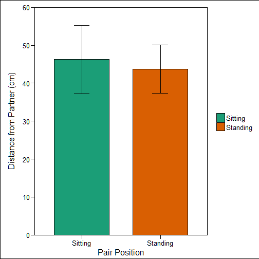

# PSYCH 372 - Assignment 1
### Connor Gaspar (20417636)
#### University of Waterloo, February 2017


```r
set.seed(372)
library(xlsx); library(ggplot2); library(ggthemes); library(psych)
library(ez); library(BayesFactor); library(knitr)
## Reading raw data
datS <- read.xlsx("p372 class data assignment 1.xlsx", sheetName="Sheet1", stringsAsFactors=F)
```


```r
## Organizing raw data
datS[c(41, 82),] <- NA # Removing header rows from data
datS1 <- datS[,1:5] 
datS2 <- datS[,6:10] 
colnames(datS2) <- colnames(datS1)
dat <- rbind(datS1, datS2)
dat <- dat[complete.cases(dat),] # Removing NA rows from data
dat$Unique <- as.factor(seq(1, nrow(dat), 1)) # Adding unique observation ID

## Cleaning raw data
dat$EntryNo <- gl(34, 5) # Providing individual entry ID's
dat <- dat[, c(6, 1:5)] # Reordering columns
dat$Distance <- gsub("'", "", dat$Distance) #Removing apostrophes from data
dat$Distance <- as.numeric(dat$Distance) # Reclassing Distance column
dat$Distance <- dat$Distance*10 # Expanding the values to multiples of 10cm

## Reclassing raw data
dat$Position <- as.factor(dat$Position) 
levels(dat$Position) <- c("Sitting", "Standing")
dat$Sex <- as.factor(dat$Sex) 
levels(dat$Sex) <- c("Women", "Men", "Mixed")

## Outlier Analysis
scores <- (dat$Distance-mean(dat$Distance))/sd(dat$Distance) # Calculating z-scores
distDat <- dat[scores<=3,] # Removal of rows where distance scores is < 3 (4% of data)
anglDat <- distDat[distDat$Angle %in% seq(0, 180, 45),] # Excluding trials where angle was coded incorrectly.
anglDat$Angle <- as.factor(anglDat$Angle)
```


```r
## Plotting distributions
hist(dat$Distance, breaks = seq(0, 700, 10), col="red",
     main="Pre-outlier exclusion distribution", xlab = "Distance (cm)") # Pre-outlier analysis
```


```r
hist(distDat$Distance, breaks = seq(0, 250, 10), col="red",
     main="Post-outlier exclusion distribution", xlab="Distance (cm)") # Post-outlier analysis
```


```r
## Creating distance plot data #
distPlotDat1 <- aggregate(Distance ~ Sex+Position, data=distDat, mean)
distPlotDat1$SD <- aggregate(Distance ~ Sex+Position, data=distDat, sd)[,"Distance"]
distPlotDat1$n <- aggregate(Distance ~ Sex+Position, data=distDat, length)[,"Distance"]

distPlotDat2 <- aggregate(Distance ~ Sex, data=distDat, mean)
distPlotDat2$SD <- aggregate(Distance ~ Sex, data=distDat, sd)[,"Distance"]
distPlotDat2$n <- aggregate(Distance ~ Sex, data=distDat, length)[,"Distance"]

distPlotDat3 <- aggregate(Distance ~ Position, data=distDat, mean)
distPlotDat3$SD <- aggregate(Distance ~ Position, data=distDat, sd)[,"Distance"]
distPlotDat3$n <- aggregate(Distance ~ Position, data=distDat, length)[,"Distance"]

anglPlotDat1 <- aggregate(Distance ~ Angle, data=anglDat, mean)
anglPlotDat1$SD <- aggregate(Distance ~ Angle, data=anglDat, sd)[,"Distance"]
anglPlotDat1$n <- aggregate(Distance ~ Angle, data=anglDat, length)[,"Distance"]

# Calculating CI's
for(i in 1:nrow(distPlotDat1)){
        
        distError <- qnorm(.975)*distPlotDat1[i, "SD"]/sqrt(distPlotDat1[i, "n"])
        distPlotDat1[i, "Lower"] <- distPlotDat1[i, "Distance"]-distError
        distPlotDat1[i, "Upper"] <- distPlotDat1[i, "Distance"]+distError
}

for(i in 1:nrow(distPlotDat2)) {
        
        distError2 <- qnorm(.975)*distPlotDat2[i, "SD"]/sqrt(distPlotDat2[i, "n"])
        distPlotDat2[i, "Lower"] <- distPlotDat2[i, "Distance"]-distError2
        distPlotDat2[i, "Upper"] <- distPlotDat2[i, "Distance"]+distError2
}

for(i in 1:nrow(distPlotDat3)){
        
        distError3 <- qnorm(.975)*distPlotDat3[i, "SD"]/sqrt(distPlotDat3[i, "n"])
        distPlotDat3[i, "Lower"] <- distPlotDat3[i, "Distance"]-distError3
        distPlotDat3[i, "Upper"] <- distPlotDat3[i, "Distance"]+distError3
}

for(i in 1:nrow(anglPlotDat1)){
        
        anglError <- qnorm(.975)*anglPlotDat1[i, "SD"]/sqrt(anglPlotDat1[i, "n"])
        anglPlotDat1[i, "Lower"] <- anglPlotDat1[i, "Distance"]-anglError
        anglPlotDat1[i, "Upper"] <- anglPlotDat1[i, "Distance"]+anglError
}

anglPlotDat1 <- anglPlotDat1[order(levels(anglPlotDat1$Angle)),]


# Plotting Distance w.r.t Position
ggplot(data=distPlotDat3, aes(x=Position, y=Distance, fill=Position))+
               geom_bar(stat="identity", position=position_dodge(.7), colour="black",
                        size=.2, width=.7)+
               geom_errorbar(aes(ymin=Lower, ymax=Upper),
                             position=position_dodge(.9), width=.2)+
               scale_y_continuous(breaks=seq(0, 60, 10), limits=c(0,60),
                                  expand=c(0,0))+
               labs(x="Pair Position",
                    y="Distance from Partner (cm)")+
               theme_base()+
               scale_fill_brewer(palette="Dark2")+
               theme(plot.margin=unit(c(.5,.25,.25,.5), "cm"),
                     axis.title.y=element_text(margin=margin(0,15,0,0)),
                     legend.title=element_blank())
```



```r
# Plotting Distance w.r.t. Sex
ggplot(data=distPlotDat2, aes(x=Sex, y=Distance, fill=Sex))+
               geom_bar(stat="identity", position=position_dodge(), colour="black",
                        size=.2)+
               geom_errorbar(aes(ymin=Lower, ymax=Upper),
                             position=position_dodge(.9), width=.2)+
               scale_y_continuous(breaks=seq(0, 60, 10), limits=c(0,60),
                                  expand=c(0,0))+
               labs(x="Group Gender Pairs",
                    y="Distance from Partner (cm)")+
               theme_base()+
               scale_fill_brewer(palette="Set1")+
               theme(plot.margin=unit(c(.5,.25,.25,.5), "cm"),
                     axis.title.y=element_text(margin=margin(0,15,0,0)),
                     legend.title=element_blank())
```


```r
# Plotting Distance w.r.t. Position grouped by Sex 
ggplot(data=distPlotDat1, aes(x=Position, y=Distance, fill=Sex))+
        geom_bar(stat="identity", position=position_dodge(), colour="black",
                 size=.2)+
        geom_errorbar(aes(ymin=Lower, ymax=Upper),
                          position=position_dodge(.9), width=.2)+
        scale_y_continuous(breaks=seq(0, 80, 10), limits=c(0, 80), 
                           expand=c(0,0))+
        labs(x="Group Gender Pairs",
             y="Distance from Partner (cm)")+
        theme_base()+ 
        scale_fill_brewer(palette = "Set1")+
        theme(plot.margin=unit(c(.5,.25,.25,.5), "cm"),
              axis.title.y=element_text(margin=margin(0,15,0,0)),
              legend.title=element_blank())
```


```r
# Plotting Distance w.r.t. Angle
ggplot(data=anglPlotDat1, aes(x=Angle, y=Distance, fill=Angle))+
        geom_bar(stat="identity", position=position_dodge(), colour="black",
                 size=.2)+
        geom_errorbar(aes(ymin=Lower, ymax=Upper),
                      position=position_dodge(.9), width=.2)+
        scale_y_continuous(breaks=seq(0, 100, 10), limits=c(0, 100),
                         expand=c(0,0))+
        labs(x="Angle between Partners", y="Distance from Partner (cm)")+
        theme_base()+
        scale_fill_brewer(type="seq", palette="BuPu")+
        theme(plot.margin=unit(c(.5,.25,.25,.5), "cm"),
              axis.title.y=element_text(margin=margin(0,15,0,0)),
              legend.title=element_blank())
```


```r
## Difference in Distance BY Sex

# Men -- Women
t.test(distDat[distDat$Sex=="Men", "Distance"],
       distDat[distDat$Sex=="Women", "Distance"],
       paired=F)
```

```
## 
## 	Welch Two Sample t-test
## 
## data:  distDat[distDat$Sex == "Men", "Distance"] and distDat[distDat$Sex == "Women", "Distance"]
## t = -0.029698, df = 101.74, p-value = 0.9764
## alternative hypothesis: true difference in means is not equal to 0
## 95 percent confidence interval:
##  -12.70454  12.32973
## sample estimates:
## mean of x mean of y 
##  45.76087  45.94828
```

```r
ttestBF(distDat[distDat$Sex=="Men", "Distance"],
       distDat[distDat$Sex=="Women", "Distance"],
       paired=F)
```

```
## Bayes factor analysis
## --------------
## [1] Alt., r=0.707 : 0.2084944 ±0.02%
## 
## Against denominator:
##   Null, mu1-mu2 = 0 
## ---
## Bayes factor type: BFindepSample, JZS
```

```r
# Men -- Mixed
t.test(distDat[distDat$Sex=="Men", "Distance"],
       distDat[distDat$Sex=="Mixed", "Distance"],
       paired=F)
```

```
## 
## 	Welch Two Sample t-test
## 
## data:  distDat[distDat$Sex == "Men", "Distance"] and distDat[distDat$Sex == "Mixed", "Distance"]
## t = 0.46923, df = 102.8, p-value = 0.6399
## alternative hypothesis: true difference in means is not equal to 0
## 95 percent confidence interval:
##  -9.564783 15.493301
## sample estimates:
## mean of x mean of y 
##  45.76087  42.79661
```

```r
ttestBF(distDat[distDat$Sex=="Men", "Distance"],
       distDat[distDat$Sex=="Mixed", "Distance"],
       paired=F)
```

```
## Bayes factor analysis
## --------------
## [1] Alt., r=0.707 : 0.2276216 ±0.03%
## 
## Against denominator:
##   Null, mu1-mu2 = 0 
## ---
## Bayes factor type: BFindepSample, JZS
```

```r
## Difference in Distance BY Position

# Standing -- Seated
t.test(distDat[distDat$Position=="Standing", "Distance"],
       distDat[distDat$Position=="Sitting", "Distance"],
       paired=F)
```

```
## 
## 	Welch Two Sample t-test
## 
## data:  distDat[distDat$Position == "Standing", "Distance"] and distDat[distDat$Position == "Sitting", "Distance"]
## t = -0.45533, df = 128.2, p-value = 0.6496
## alternative hypothesis: true difference in means is not equal to 0
## 95 percent confidence interval:
##  -13.715353   8.583774
## sample estimates:
## mean of x mean of y 
##  43.68421  46.25000
```

```r
ttestBF(distDat[distDat$Sex=="Men", "Distance"],
       distDat[distDat$Sex=="Mixed", "Distance"],
       paired=F)
```

```
## Bayes factor analysis
## --------------
## [1] Alt., r=0.707 : 0.2276216 ±0.03%
## 
## Against denominator:
##   Null, mu1-mu2 = 0 
## ---
## Bayes factor type: BFindepSample, JZS
```

```r
####

## Two-way ANOVAs 

# Distance ~ Sex*Position

ezANOVA(data=distDat,
        dv=Distance,
        wid=Unique,
        between=.(Position, Sex),
        detailed=T)
```

```
## $ANOVA
##         Effect DFn DFd       SSn      SSd         F         p p<.05
## 1     Position   1 157  284.8680 186028.3 0.2404166 0.6245900      
## 2          Sex   2 157  379.3706 186028.3 0.1600864 0.8522091      
## 3 Position:Sex   2 157 4721.6444 186028.3 1.9924343 0.1397963      
##           ges
## 1 0.001528974
## 2 0.002035167
## 3 0.024753063
## 
## $`Levene's Test for Homogeneity of Variance`
##   DFn DFd      SSn      SSd        F         p p<.05
## 1   5 157 4435.989 126450.2 1.101541 0.3618346
```

```r
anovaBF(Distance ~ Position*Sex, data=distDat, progress=F)
```

```
## Bayes factor analysis
## --------------
## [1] Position                      : 0.1895959   ±0%
## [2] Sex                           : 0.07038591  ±0.02%
## [3] Position + Sex                : 0.01314613  ±1.65%
## [4] Position + Sex + Position:Sex : 0.007130708 ±3.16%
## 
## Against denominator:
##   Intercept only 
## ---
## Bayes factor type: BFlinearModel, JZS
```

```r
# Distance ~ Position*Angle

ezANOVA(data=anglDat,
        dv=Distance,
        wid=Unique,
        between=.(Position, Angle),
        detailed=T)
```

```
## $ANOVA
##           Effect DFn DFd       SSn      SSd         F           p p<.05
## 1       Position   1 145   519.087 166803.9 0.4512342 0.502818296      
## 2          Angle   4 145 16501.488 166803.9 3.5861211 0.008060148     *
## 3 Position:Angle   4 145  4455.350 166803.9 0.9682413 0.426917452      
##           ges
## 1 0.003102305
## 2 0.090021845
## 3 0.026015236
## 
## $`Levene's Test for Homogeneity of Variance`
##   DFn DFd     SSn      SSd         F         p p<.05
## 1   9 145 4523.25 112693.8 0.6466598 0.7555617
```

```r
anovaBF(Distance ~ Position*Angle, data=anglDat, progress=F)
```

```
## Bayes factor analysis
## --------------
## [1] Position                          : 0.185753  ±0%
## [2] Angle                             : 8.018534  ±0.04%
## [3] Position + Angle                  : 1.703854  ±1%
## [4] Position + Angle + Position:Angle : 0.4225701 ±1.63%
## 
## Against denominator:
##   Intercept only 
## ---
## Bayes factor type: BFlinearModel, JZS
```

```r
# Distance ~ Angle regression
lm(Distance ~ as.numeric(Angle), data=anglDat)
```

```
## 
## Call:
## lm(formula = Distance ~ as.numeric(Angle), data = anglDat)
## 
## Coefficients:
##       (Intercept)  as.numeric(Angle)  
##             57.64              -4.52
```


```r
knit2html("Assignment1.Rmd", quiet = T)
```

```
## Error in parse_block(g[-1], g[1], params.src): duplicate label 'Setup'
```
